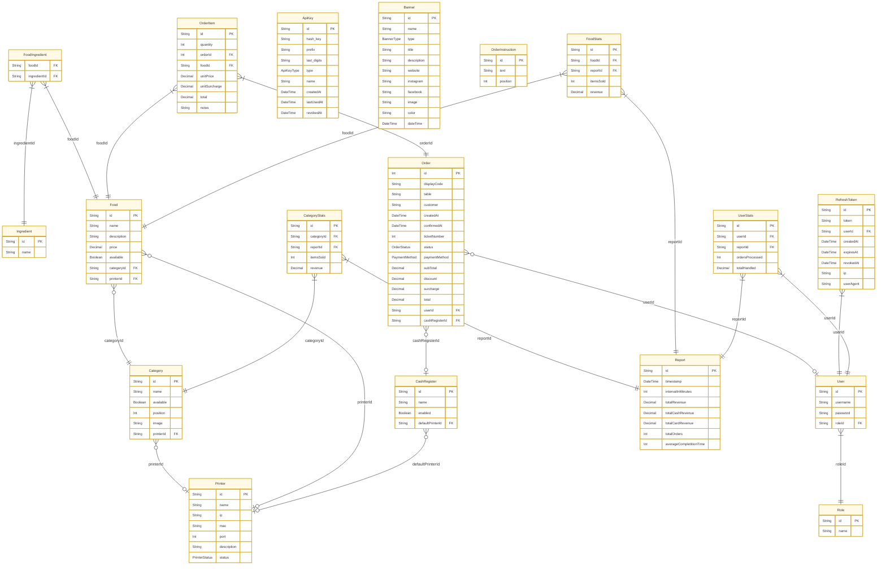

# Database

MySagra uses **MySQL** as its primary database, managed via [Prisma ORM](https://www.prisma.io/). Migrations are applied automatically on API startup when `MIGRATE_ON_START=true` is set in the environment (default for the Docker Compose setup).

## ER Diagram

<div className="overflow-x-auto border rounded-lg bg-muted/30">

</div>

> **Tip:** Use browser zoom (Ctrl/Cmd + scroll) to pan and zoom the diagram, or drag horizontally to scroll on smaller screens.

## Model reference

### Menu

| Model | Table | Description |
|---|---|---|
| `Category` | `categories` | Groups of foods. Each category can be linked to a specific printer for ticket routing. |
| `Food` | `foods` | Individual menu items. Belong to a category; can override the category printer. |
| `Ingredient` | `ingredients` | A shared pool of ingredients. |
| `FoodIngredient` | `food_ingredients` | Many-to-many join between `Food` and `Ingredient`. |

### Orders

| Model | Table | Description |
|---|---|---|
| `Order` | `orders` | A customer order. Tracks table, customer name, payment method, totals, and status lifecycle. |
| `OrderItem` | `order_items` | A line item inside an order. Stores the food, quantity, unit price, and optional notes. |

#### Order status lifecycle

```
PENDING → CONFIRMED → COMPLETED → PICKED_UP
```

| Status | Meaning |
|---|---|
| `PENDING` | Order created, not yet confirmed by the cashier |
| `CONFIRMED` | Payment taken, ticket printed |
| `COMPLETED` | Food is ready for pickup |
| `PICKED_UP` | Customer collected the order |

### Users & authentication

| Model | Table | Description |
|---|---|---|
| `Role` | `roles` | Named roles (e.g. `admin`, `cashier`). Controls API permissions. |
| `User` | `users` | Operator accounts. Each user has one role. |
| `RefreshToken` | `refresh_tokens` | JWT refresh tokens with expiry, revocation timestamp, and client metadata. |

### Hardware

| Model | Table | Description |
|---|---|---|
| `Printer` | `printers` | ESC/POS network printers (IP + port). Status tracked as `ONLINE`, `OFFLINE`, or `ERROR`. MAC address optional for identification. |
| `CashRegister` | `cash_registers` | Named cash register stations. Each can have a default printer; orders are associated to a register. |

### Configuration & Reporting

| Model | Table | Description |
|---|---|---|
| `ApiKey` | `api_keys` | Machine-to-machine authentication keys. Two types: `PRINTER` (prefix `ms_pt_`) and `WEBAPP` (prefix `ms_wb_`). |
| `Banner` | `banners` | Promotional images for POS and customer screens. Type: `EVENT` (branding) or `SPONSOR` (logos). |
| `OrderInstruction` | `order_instructions` | Instructional text shown to cashiers during order creation, sorted by position. |
| `Report` | `reports` | Aggregated sales statistics snapshots, grouped by time window (hourly, daily, or full-period). Linked to granular stats per category, food, and user. |
| `CategoryStats` | `category_stats` | Per-category sales metrics for a given report period. Tracks items sold and revenue by category. |
| `FoodStats` | `food_stats` | Per-food sales metrics for a given report period. Tracks items sold and revenue by menu item. |
| `UserStats` | `user_stats` | Per-operator performance metrics for a given report period. Tracks orders processed and total cash/card handled. |
